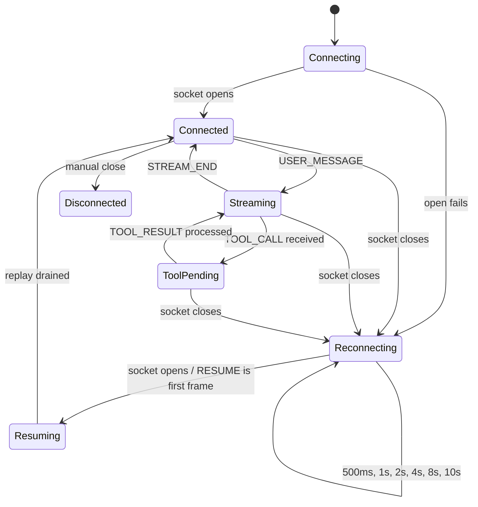
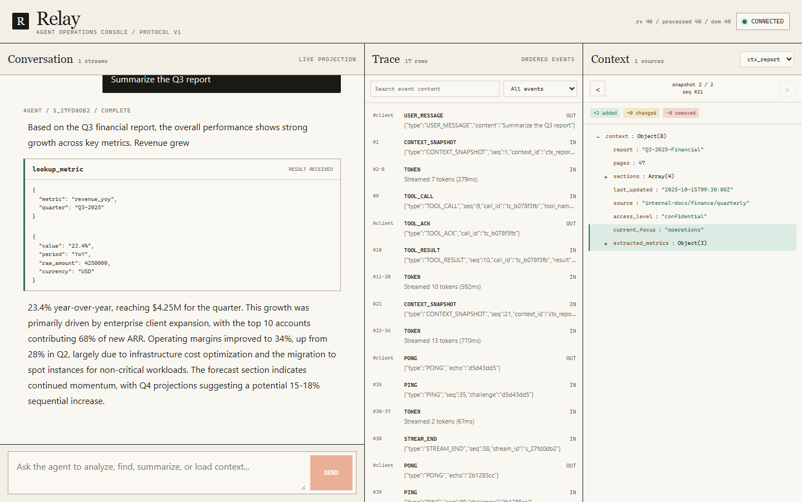

# Relay Agent Console

Relay is a Next.js console for the supplied Alchemyst agent server. The WebSocket protocol is handled outside React: messages are validated, deduplicated, reordered by `seq`, and then projected into chat, trace, and context state. React only renders those projections and records the highest sequence committed to the DOM.

## Run it

Requirements: Node.js 20+ and Docker.

Start the supplied agent server from `June-2026_FullStackAI`:

```bash
docker build -t agent-server ./agent-server
docker run --rm -p 4747:4747 agent-server
```

Start the console:

```bash
cd agent-console
npm install
npm run build
npm run start
```

Open `http://localhost:3000`.

For chaos mode, replace the backend command with:

```bash
docker run --rm -p 4747:4747 agent-server --mode chaos
```

Useful prompts:

- `Summarize the Q3 report`
- `Analyze the correlation`
- `Find the deployment SLA`
- `Show the full database schema`
- `Write a long detailed document`

## Connection state machine



The sequence buffer has its own smaller state transition:

```text
receive event
  -> duplicate or already processed? discard
  -> future seq? store in Map
  -> expected seq? drain this event and every contiguous buffered event
  -> React projects ordered events
  -> layout commit advances lastCommittedSeq
```

## Screenshots

### Stream with tool interruption



### Trace timeline


### Context diff


## Verification

```bash
npm test
npm run lint
npm run typecheck
npm run build
```

The backend log is available at `http://localhost:4747/log`. In normal-mode
browser verification, tool acknowledgements were accepted and heartbeat
latency was 1-2ms.

## Chaos recording

The final submission still needs a 3-5 minute screen recording. A reliable run
order is documented in [CHAOS_RECORDING.md](CHAOS_RECORDING.md).
