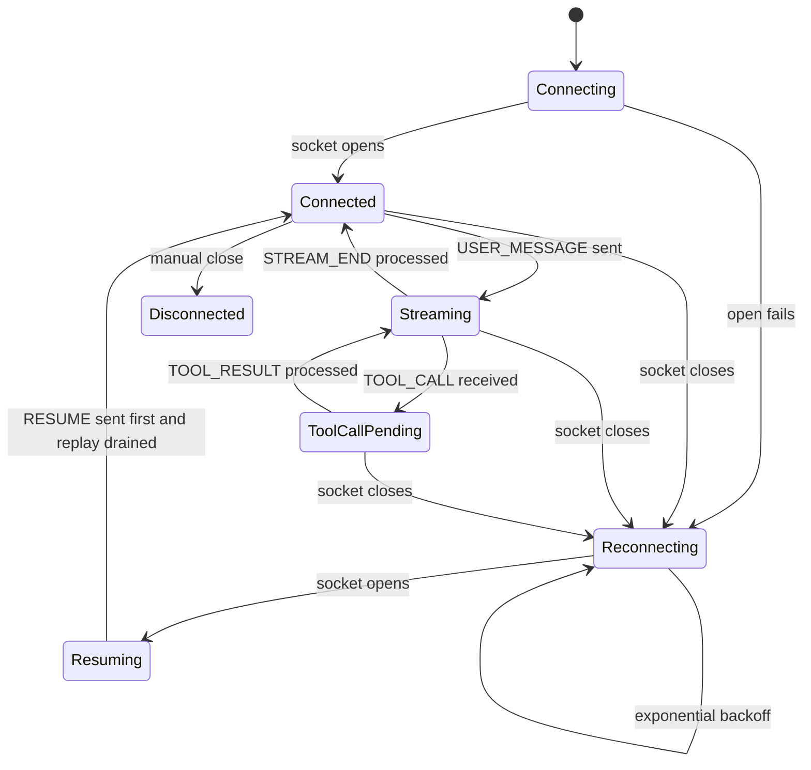
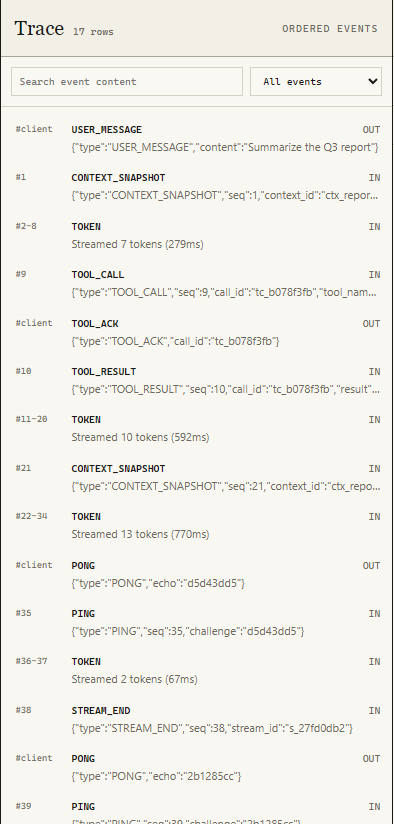
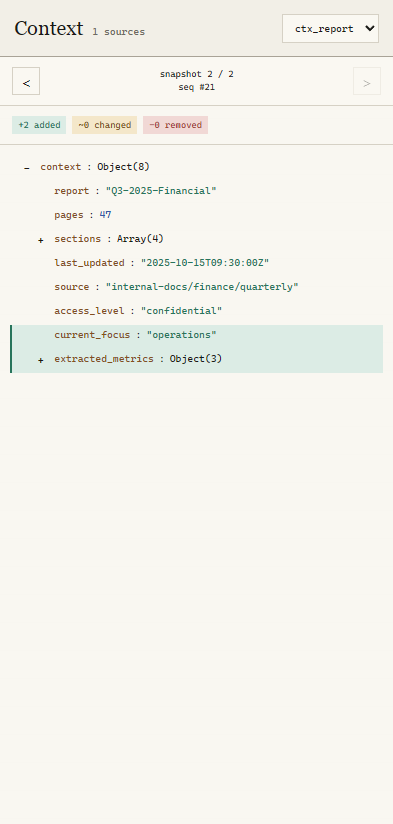

# Relay Agent Console

Relay is a Next.js App Router application for inspecting a streaming AI agent
over WebSockets. A protocol layer validates messages, reorders and deduplicates
events by sequence number, and projects them into separate chat, trace, and
context views. React renders those projections while tracking the highest
sequence committed to the DOM for reconnect recovery.

## Requirements

- Node.js 20 or newer

## Run

Start the supplied agent server from the original hiring repository:

```bash
git clone https://github.com/Alchemyst-ai/hiring.git
cd hiring/June-2026_FullStackAI/agent-server
npm install
npm run build
npm run start
```

In another terminal, install and start the application from the repository
root:

```bash
npm install
npm run build
npm run start
```

Open `http://localhost:3000`.

No environment variables or additional configuration are required.

For chaos mode:

```bash
cd hiring/June-2026_FullStackAI/agent-server
npm run start -- --mode chaos
```

## Connection State Machine



The reconnect delays are `500ms`, `1s`, `2s`, `4s`, `8s`, then `10s`.

## Screenshots

### Streamed Response With Tool Call


### Agent Trace Timeline



### Context Inspector Diff



## Chaos Mode Recording

[Download the chaos mode recording](public/chaos-mode-recording.mp4)

The recording demonstrates:

1. A connection drop followed by reconnect and `RESUME`.
2. Out-of-order and duplicate event handling.
3. Multiple tool calls rendered as separate cards.
4. A context snapshot larger than 500KB.
5. Empty heartbeat challenges answered without a crash.

## Test Prompts

- `Summarize the Q3 report`
- `Analyze the correlation`
- `Find the deployment SLA`
- `Show the full database schema`
- `Write a long detailed document`

## Verification

```bash
npm test
npm run lint
npm run typecheck
npm run build
```

The backend exposes protocol logs at `http://localhost:4747/log`. During local
verification, `TOOL_ACK`, `PONG`, and `RESUME` entries were accepted with an
`ok` verdict.

Implementation tradeoffs and scaling notes are documented in
[DECISIONS.md](DECISIONS.md).
